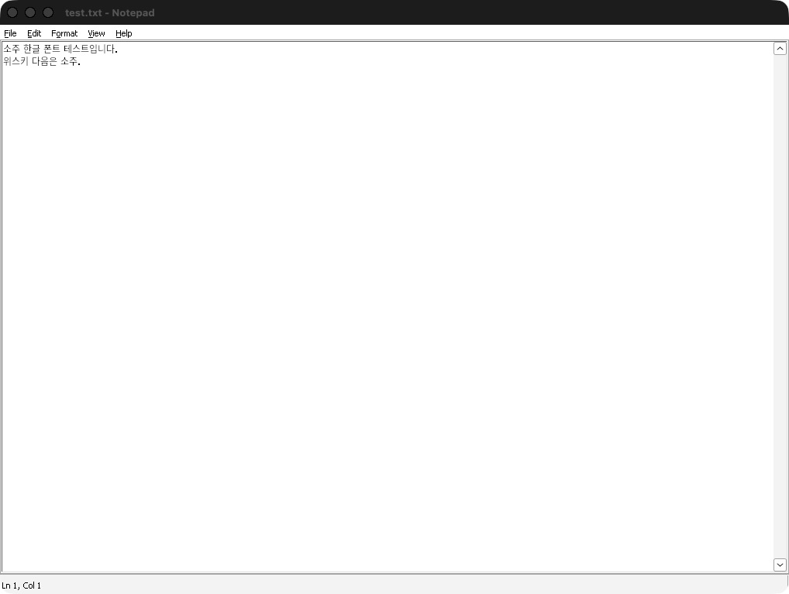

<div align="center">
  
  <h1>Soju</h1>
  <p><i>위스키 다음은 소주</i></p>
  <p>
    <a href="../../actions/workflows/ci.yml"></a>
    
    
  </p>
  <p><a href="README.md">English</a> | 한국어</p>
</div>

맥에서 윈도우 앱과 게임을 — 진짜 맥 앱처럼 실행하세요. Whisky의 개발이 2025년에 중단된 뒤, Soju는 네이티브 SwiftUI로 만든 오픈소스 후계자입니다. Whisky에는 없던 대표 기능이 하나 있습니다: 어떤 윈도우 프로그램이든 독립 실행되는 맥 앱으로 만들어 줍니다.

<div align="center">
  
  <p><i>보틀, 원클릭 실행, exe에서 직접 추출한 진짜 프로그램 아이콘</i></p>
</div>

## 특징

- **맥 앱으로 내보내기** — 프로그램을 우클릭하면 독립 `.app`이 생깁니다. exe 안의 진짜 아이콘까지 추출해서 Dock, Launchpad, Spotlight에 등록되고, Soju가 꺼져 있어도 더블클릭으로 바로 실행됩니다.
- **보틀** — 클릭 한 번으로 만드는 독립 윈도우 환경. 보틀마다 윈도우 버전(11, 10, 8.1, 7, XP)을 따로 설정할 수 있습니다.
- **엔진 두 종류** — 일반용 [Wine Staging](https://github.com/Gcenx/macOS_Wine_builds), 그리고 DirectX 12 게임용 애플 [Game Porting Toolkit](https://github.com/Gcenx/game-porting-toolkit)(D3DMetal). 둘 다 필요할 때 업스트림 릴리즈에서 내려받으며, 이미 설치된 Wine이나 CrossOver도 자동 인식합니다.
- **스팀 원클릭 설치** — Valve 공식 CDN에서 설치 파일을 받아 보틀 안에서 바로 실행해 줍니다.
- **한글 폰트 픽스** — 새 보틀에 Noto Sans CJK KR과 폰트 매핑(맑은 고딕, 굴림 등)이 자동으로 들어가서, 한글이 네모(두부)로 깨지지 않습니다. 기본 켜짐, 끌 수 있음.
- **Whisky 가져오기** — 쓰던 Whisky 보틀을 클릭 한 번에 옮겨 옵니다.
- 네이티브 SwiftUI, 라이트/다크 모드. Electron 없음, Homebrew 없음, 터미널 없음.

<div align="right">
  
  <p><i>한글이 처음부터 제대로 나옵니다 — 두부 없음</i></p>
</div>

## 시스템 요구사항

- macOS 14 Sonoma 이상
- Apple Silicon: Rosetta 2 필요 — Soju가 직접 확인하고 설치 명령어 한 줄을 알려줍니다
- Intel 맥 지원 (유니버설 바이너리)

## 설치

[Releases](../../releases)에서 최신 `Soju-*.zip`을 받아 압축을 풀고 `Soju.app`을 응용 프로그램 폴더로 옮기세요.

빌드는 공증(notarize)되어 있지 않습니다(이 프로젝트 뒤에 유료 개발자 계정이 없습니다). 첫 실행 시 macOS가 경고하면 앱을 우클릭해서 열기를 선택하거나, 다음을 실행하세요:

```
xattr -cr /Applications/Soju.app
```

## Whisky에서 넘어오기

Soju가 기존 Whisky 보틀을 자동으로 찾아 줍니다 — 툴바의 가져오기 버튼을 누르면 끝. 프리픽스는 복사 방식이라 원본은 그대로 남습니다.

## 작동 방식

Soju 자체는 얇은 네이티브 관리자이고, 호환 레이어는 [Wine](https://www.winehq.org/)입니다. 엔진은 `~/Library/Application Support/Soju/Engines`에, 보틀은 `.../Soju/Bottles`에 일반 Wine 프리픽스로 저장됩니다. 내보낸 맥 앱은 엔진·보틀·프로그램 경로가 새겨진 작은 런처 번들이라 즉시, 독립적으로 실행됩니다.

## 소스에서 빌드

```
git clone https://github.com/0oooh/soju
cd soju
Scripts/build-app.sh
open build/Soju.app
```

Swift 5.9+ (Xcode 커맨드라인 툴) 필요. `swift test`로 유닛 테스트를, `SOJU_IT=1 swift test --filter Integration`으로 실제 엔진을 사용하는 전체 수명주기 테스트를 실행할 수 있습니다.

## 로드맵

- DXMT·DXVK 그래픽 백엔드 (Metal 위에서 더 빠른 DirectX 11)
- 커뮤니티 게임 레시피 — 게임별 검증된 설정을 원클릭 적용
- Winetricks 통합
- 공증된 릴리즈

## 크레딧

- [Wine](https://www.winehq.org/) — 이 모든 것을 가능하게 하는 호환 레이어 (LGPL)
- [Gcenx](https://github.com/Gcenx) — 꾸준히 관리되는 macOS Wine 빌드
- [Whisky](https://github.com/Whisky-App/Whisky) — 이 프로젝트의 영감. 편히 쉬기를

## 라이선스

Soju 코드는 MIT입니다. Soju는 Wine을 번들하거나 재배포하지 않으며, 엔진은 첫 실행 시 업스트림 릴리즈에서 내려받습니다.
