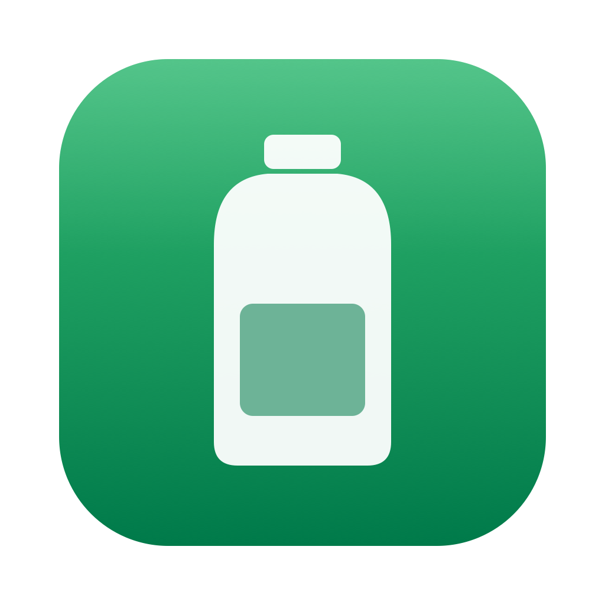
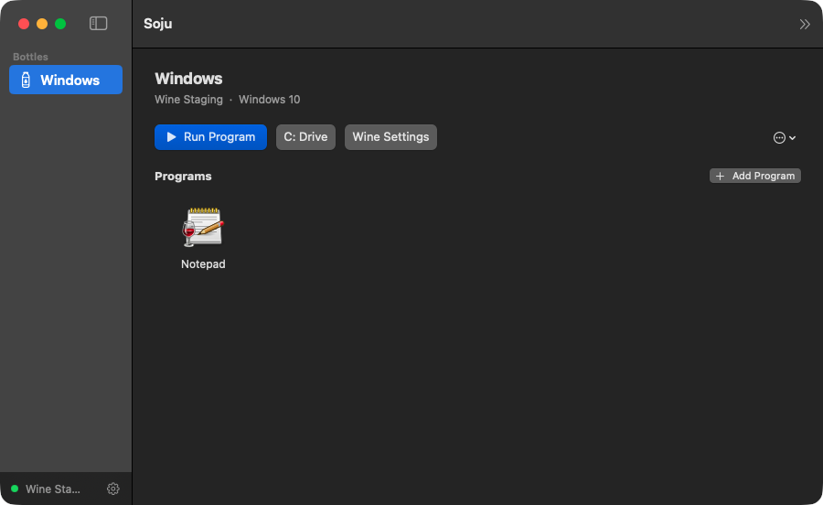

<div align="center">
  
  <h1>Soju</h1>
  <p><i>Turn Windows apps and games into real Mac apps</i></p>
  <p>
    <a href="../../actions/workflows/ci.yml"></a>
    
    
  </p>
  <p>English | <a href="README.ko.md">한국어</a> | <a href="README.ja.md">日本語</a></p>
</div>

Soju runs Windows apps and games on macOS through Wine — no VM, no subscription, no terminal. Its signature trick: export any Windows program as a standalone Mac app that lives in your Dock and launches with a double-click, even when Soju is closed. Coming from the discontinued Whisky? Soju imports your bottles in one click.

<div align="center">
  
  <p><i>Bottles, one-click launch, and real program icons extracted straight from the exe</i></p>
</div>

## Features

- **Export as a Mac app** — right-click any program, get a standalone `.app` with its real icon in your Dock, Launchpad, and Spotlight. It launches the program directly; Soju does not even need to be running.
- **Bottles** — self-contained Windows environments, created in one click, each with its own Windows version (11, 10, 8.1, 7, XP).
- **Two engines** — [Wine Staging](https://github.com/Gcenx/macOS_Wine_builds) for general use, and Apple's [Game Porting Toolkit](https://github.com/Gcenx/game-porting-toolkit) (D3DMetal) for DirectX 12 games. Both download from their upstream releases on demand; existing Wine and CrossOver installs are detected too.
- **Install Steam in one click** — Soju fetches the official installer from Valve's CDN and runs it in your bottle.
- **Whisky import** — your old Whisky bottles come over in one click.
- Native SwiftUI, light and dark mode. No Electron, no Homebrew, no terminal.

## System Requirements

- macOS 14 Sonoma or later
- Apple Silicon: Rosetta 2 — Soju checks for it and shows the one-line install command
- Intel Macs supported (universal binary)

## Installation

Download the latest `Soju-*.zip` from [Releases](../../releases), unzip, drag `Soju.app` to Applications.

Builds are not notarized (there is no paid developer account behind this project). On first launch, right-click the app and choose Open — or run `xattr -cr /Applications/Soju.app`.

## Coming from Whisky

Soju detects your Whisky bottles automatically — use the import button in the toolbar. Your prefixes are copied, so the originals stay untouched.

## How it works

Soju itself is a thin native manager; the compatibility layer is [Wine](https://www.winehq.org/). Engines live in `~/Library/Application Support/Soju/Engines`, bottles are plain Wine prefixes in `.../Soju/Bottles`. Exported Mac apps are small launcher bundles that exec Wine directly with the engine, bottle, and program paths baked in — which is why they start instantly and work on their own.

## Building from source

```
git clone https://github.com/0oooh/soju
cd soju
Scripts/build-app.sh
open build/Soju.app
```

Requires Swift 5.9+ (Xcode command line tools). `swift test` runs the unit tests; `SOJU_IT=1 swift test --filter Integration` runs a full bottle lifecycle against a real engine.

## Roadmap

- DXMT and DXVK graphics backends (faster DirectX 11 on Metal)
- Community game recipes — known-good settings per game, applied in one click
- Winetricks integration
- Notarized releases

## Credits

- [Wine](https://www.winehq.org/) — the compatibility layer that makes all of this possible (LGPL)
- [Gcenx](https://github.com/Gcenx) — actively maintained macOS Wine builds
- [Whisky](https://github.com/Whisky-App/Whisky) — the inspiration for this project; rest well

## License

MIT for Soju's own code. Soju does not bundle or redistribute Wine; engines are downloaded from their upstream releases at first run.
